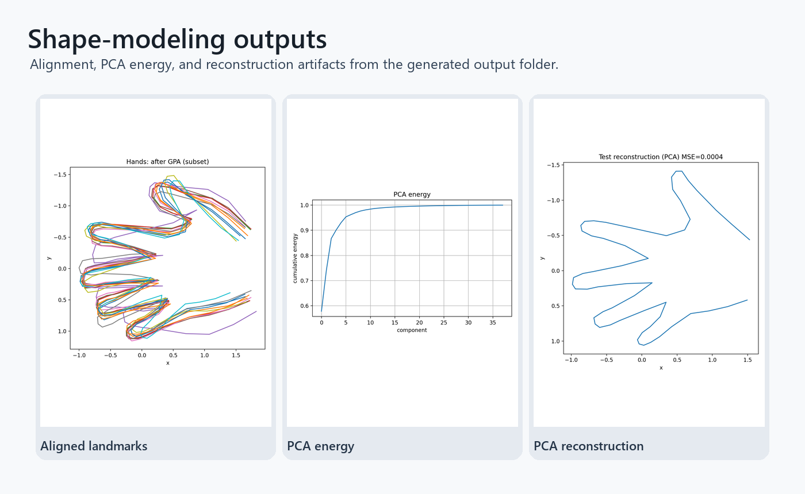

# Statistical Shape Modeling

Shape analysis project covering landmark alignment, template matching with distance transforms, PCA, and probabilistic PCA.

## Highlights

- Loads and visualizes 2D landmark annotations.
- Aligns shapes with generalized Procrustes analysis.
- Matches a rat landmark template using an edge distance transform.
- Fits PCA and PPCA shape models and visualizes principal modes.
- Compares PCA and PPCA reconstructions on held-out shapes.

## Repository Layout

- `statistical_shape_modeling.py` - end-to-end shape modeling workflow.
- `rat.webp` and `rat.txt` - image and landmark template.
- `hands_train.npy` and `hands_test.npy` - landmark datasets.
- `output/` - generated overlays, modes, and reconstruction figures.

## Setup

```bash
pip install -r requirements.txt
```

## Run

```bash
python statistical_shape_modeling.py
```

## Shape-model outputs



Aligned landmarks, PCA energy, and PCA reconstruction output from the shape-modeling script.


## Modeling workflow

- Generalized Procrustes alignment and PCA/PPCA shape modeling.
- Generated diagnostic plots for modes, reconstruction, and explained variance.
- Template-matching experiments alongside statistical shape analysis.


## Follow-up validation

- The project is dataset-focused and not packaged as a reusable library.
- Model quality depends on the landmark consistency of the training shapes.
- Next steps: add quantitative reconstruction error tables and cross-validation splits.

